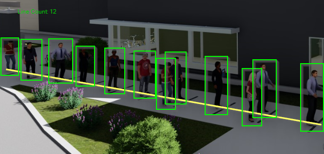
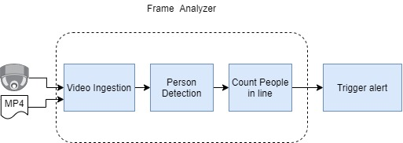

# Retail Pandemic Reference Implementation - Line Monitoring

| Details               |              |
|-----------------------|---------------|
| Target OS:            |  Ubuntu\* 18.04 LTS   |
| Programming Language: |  Python* 3.5 |
| Time to Complete:     |  1 hour     |



## What it does

This reference implementation showcases a retail application that counts peple standing in waiting line in a retail store. The application estimates how many people are waiting in a line by doing an intersection between the people detected and a virtual line.

## Requirements

### Hardware

* 6th gen or greater Intel® Core™ processors or Intel® Xeon® processor, with 8Gb of RAM

### Software

* [Ubuntu 18.04](http://releases.ubuntu.com/18.04/)

* [Intel® Distribution of OpenVINO™ toolkit 2020.3 Release](https://software.intel.com/content/www/us/en/develop/tools/openvino-toolkit.html)

## How It works

The application uses the Inference Engine and Model Downloader included in Intel® Distribution of OpenVINO Toolkit. It uses a video source as input, analyze frame by frame using a pre-trained model for people detection and finally check if people detected are in the line area. The queue line area is defined by a virtual line in the configuration file. The result of the the amount of people in line are showcased in the screen.



## Setup

### Get the code

Clone the reference implementation:

```bash
sudo apt-get update && sudo apt-get install git
git clone github.com:intel-iot-devkit/line-monitoring.git
```

### Install Intel® Distribution of OpenVINO™ Toolkit

Refer to https://software.intel.com/en-us/articles/OpenVINO-Install-Linux for more information about how to install and setup the Intel® Distribution of OpenVINO™ toolkit.

### Installing Python requirements

To install the dependencies of the Reference Implementation, run the following commands:

```bash
  cd <path_to_line-monitoring-directory>
  pip3 install -r requirements.txt
```

### Which model to use
This application uses the [person-detection-retail-0013](https://docs.openvinotoolkit.org/2020.3/_models_intel_person_detection_retail_0013_description_person_detection_retail_0013.html) Intel® pre-trained models, that can be downloaded using the **model downloader**. The **model downloader** downloads the __.xml__ and __.bin__ files that is used by the application.

To download the models Intel® model, run the following command:

```bash
mkdir models
cd models
python3 /opt/intel/openvino/deployment_tools/open_model_zoo/tools/downloader/downloader.py --name person-detection-retail-0013 --precisions FP32
```

The models will be downloaded inside the following directories:

```bash
- models/intel/person-detection-retail-0013/FP32/
```

### The Config File

The _config.json_ contains the path to the videos and models that will be used by the application and also the coordinates of a virtual line.

The _config.json_ file is of the form name/value pair. Find below an example of the _config.json_file:

```bash
{
  "video": "path/to/video/myvideo.mp4",
  "pedestrian_model_weights": "models/intel/person-detection-retail-0013/FP32/person-detection-retail-0013.bin",
  "pedestrian_model_description": "models/intel/person-detection-retail-0013/FP32/person-detection-retail-0013.xml",
  "coords": [[10, 40], [80, 80]]
}
```

Note that __coords__ represents a the virtual queue line defined by two points with x,y coordinates.
The value of __video__ represents the path of the video file to use as an input. Update "path/to/video/myvideo.mp4" with your file name.

### Which Input video to use

The application works with any input video format supported by [OpenCV](https://opencv.org/).

Sample video: https://www.pexels.com/video/4775515/

Data set subject to license https://www.pexels.com/license. The terms and conditions of the data set license apply. Intel does not grant any rights to the data files.

To use any other video, specify the path in config.json file.

## Setup the environment

You must configure the environment to use the Intel® Distribution of OpenVINO™ toolkit one time per session by running the following command:

```bash
source /opt/intel/openvino/bin/setupvars.sh -pyver 3.5
```

__Note__: This command needs to be executed only once in the terminal where the application will be executed. If the terminal is closed, the command needs to be executed again.

## Run the application

Change the current directory to the project location on your system:

```bash
    cd <path-to-line-monitoring-directory>
```

### Running on the CPU

When running Intel® Distribution of OpenVINO™ toolkit Python applications on the CPU, the CPU extension library is required. This can be found at:

```bash
/opt/intel/openvino/deployment_tools/inference_engine/lib/intel64/
```

Run the python script.

```bash
python3 linemonitoring.py
```
